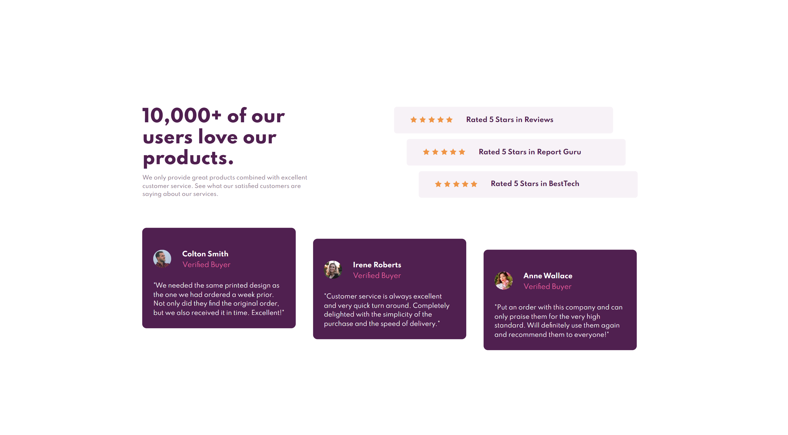
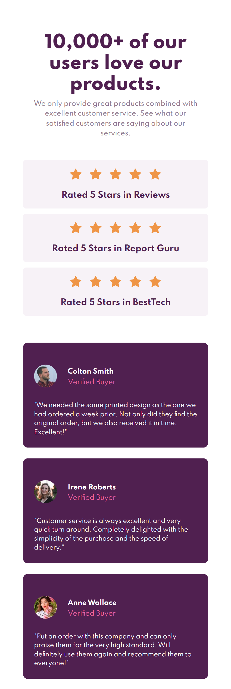

# Frontend Mentor - Social proof section solution

This is a solution to the [Social proof section challenge on Frontend Mentor](https://www.frontendmentor.io/challenges/social-proof-section-6e0qTv_bA). Frontend Mentor challenges help you improve your coding skills by building realistic projects.

## Table of contents

## Overview

### Screenshot

Desktop View

Mobile View

### Links

- Solution URL: [Solution](https://www.frontendmentor.io/solutions/faq-accordion-card-ZRNKpuudS)
- Live Site URL: [Live Site](https://sansarj17.github.io/FM-FaqAccordionCard/)

### Built with

- CSS Grid
- CSS Flexbox
- CSS custom properties
- Javascript(Some ES6 features used)

## Author

- Github - [@sansarj17](https://github.com/sansarj17/)
- Frontend Mentor - [@sansarj17](https://www.frontendmentor.io/profile/sansarj17)
